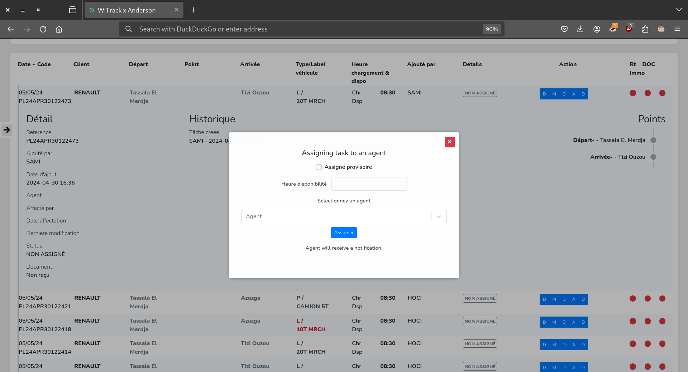

# Transportation and Logistics Management System

Management/tracking System developed for anderson a leading Transportation and logistics company. The system is designed to streamline operations and enhance efficiency for various roles within the organization, including administrators, managers, agents, and drivers.

[Link to company landing page/website](https://andersonlogistique.com/)

## Key Features:

- **Multi-role Access:** Users can log in with different roles, each with its set of permissions tailored to their responsibilities within the company.

- **Tasks Management:** The system provides a centralized platform for managing tasks, allowing users to view, filter, create, edit, and assign tasks effortlessly. Users can specify task details such as client information, locations, dates, vehicle types, and track task history including creation, edits, assignments, and notes.

- **Reporting:** Generate comprehensive reports on tasks for selected periods, clients, and dates. Export data directly to Excel or CSV files for further analysis and sharing.

- **Agents Management:** view and filter agent details, enable/disable agents, and add new ones as needed.

- **Clients Management:** Manage client information efficiently through the Clients page .

- **Dashboard:** Gain insights into business performance and trends with interactive analytics graphs and charts displayed on the dashboard.

## Technologies Used:

- Frontend: react/javascript
- Backend: symfony/php
- Database: Mysql

## Web App UI:

